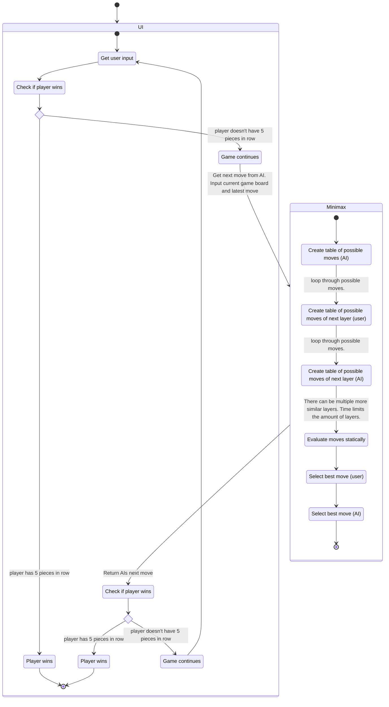

# Implementation document
(Draft)

## Move Evaluation

<table>
    
<th>number</th><th>description</th><th>points</th>

    <tr><td>0.</td><td>LOST - other has 5th in row </td><td>-8</td></tr>
    <tr><td>1.</td><td>ATTACK - add 5th for the row</td><td>8</td></tr>
    <tr><td>2.</td><td>BLOCK - block 5th in a row with one sided empty space</td><td>-7</td></tr>
    <tr><td>3.</td><td>ATTACK - add 4th in a row both sides empty space</td><td>7</td></tr>
    <tr><td>3.</td><td>ATTACK - add 4th in a row (one or more empty space)</td><td>6</td></tr>
    <tr><td>4.</td><td>BLOCK - block 4th in a row with both sides empty space</td><td>-6</td></tr>
    <tr><td>5.</td><td>ATTACK - add center for dual 3rd in a row with empty spaces around (4) </td><td>5</td></tr>
    <tr><td>6.</td><td>BLOCK - block center for dual 3rd in a row with empty spaces around (4)</td><td>-5</td></tr>
    <tr><td>7.</td><td>ATTACK - add 3rd in a row with empty spaces around</td><td>4</td></tr>
    <tr><td>8.</td><td>BLOCK - block center for dual 3rd in a row with 3 or less empty spaces around</td><td>-4</td></tr>
    <tr><td>9.</td><td>ATTACK - add 3rd in a row with one side empty space</td><td>3</td></tr>
    <tr><td>10.</td><td>BLOCK - block 4th in a row with one side empty space</td><td>-3</td></tr>
    <tr><td>11.</td><td>BLOCK - block 3rd in a row with empty spaces around</td><td>-2</td></tr>
    <tr><td>12.</td><td>ATTACK - add 2nd in a row with empty spaces around</td><td>2</td></tr>
    <tr><td>13.</td><td>BLOCK - block 3rd in a row with one side empty spaces around</td><td>-1</td></tr>
    <tr><td>14.</td><td>BLOCK - block 2nd in a row with empty spaces around (4)</td><td>0</td></tr>
    <tr><td>15.</td><td>ATTACK - add 1st in a row with as many empty spaces around as possible</td><td>1</td></tr>
</table>

## Program flow

