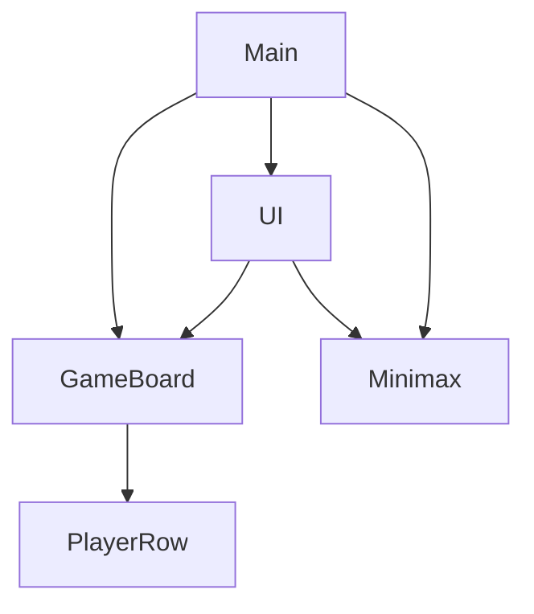
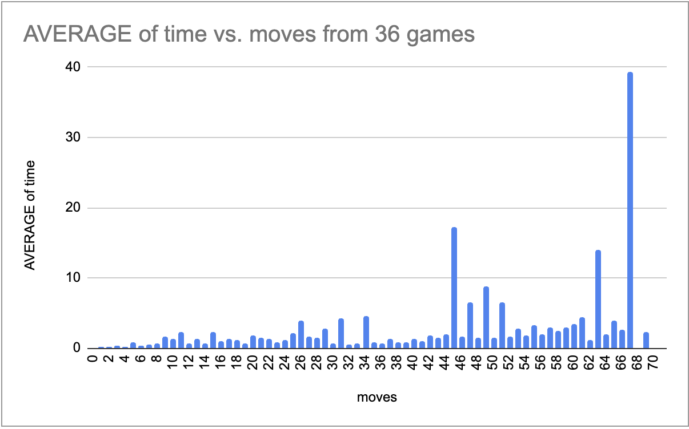
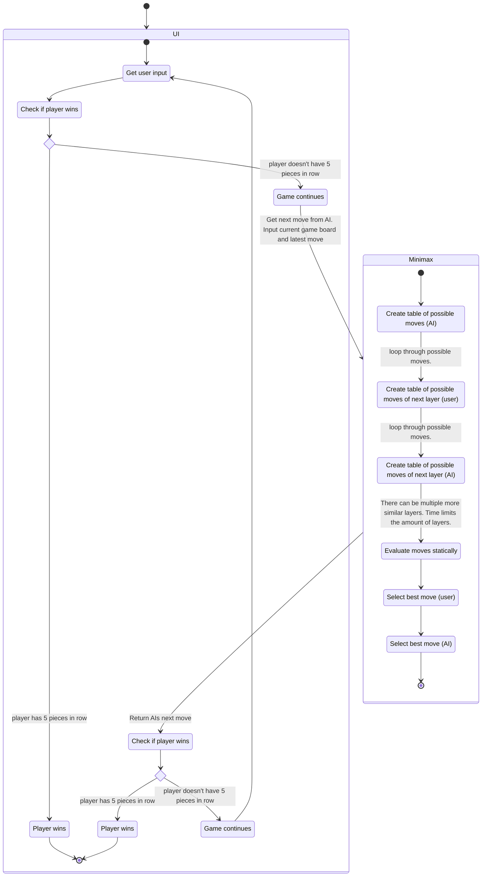

# Implementation document
This gomoku app is using Minimax algorithm with alpha-beta pruning enhanced with iterative deepening. 

## Program structure
Program starts from main that intializes GameBoard, Minimax and UI classes. GameBoard class is used from Minimax class. Both GameBoard and Minimax classes are used from the UI. 

- UI
    - draws the game
    - gets input from user
    - gets AIs next move from minimax
- Minimax
    - finds the next best move for AI
- GameBoard keeps track of the following
    - players rows
    - next moves to check
    - the used spaces
- PlayerRow keeps track of the following
    - row potential
    - moves related to the row
    - free spaces around the row

## Algorithm
### Minimax [2]
Minimax is the algorithm used to get the best possible next move for the AI. The algorithm is going through all possible moves to a certain depth where the current game status is evaluated. Evaluation is explained in later section. Every other layer is maximizing and every other layer is minimizing. So other player seeks to get as big evaluation score as possible and the other player seeks to get the smallest score as possible. Minimax is turn based algorithm where two players take turns and play optimally. The deepest layer is the evaluation layer. So the algorithm first checks all the possible moves that can be done and then for each of those moves the algorithm checks all possible next moves and so on. This continues until predefined depth, one of the players have winning move or game board is out of moves. 

In the example below the bottom layer is the evaluation layer. This is where the the current game status is evaluated after the last move is done. Then layer above it is maximizing layer. This layer takes the biggest of the possible score values of the evaluation layer related to the move. Next layer is minimizing so it will take the smallest value of the maximizing layer related to this minimizing layers possible moves. The top layer is maximizing layer which will select what is the best possible move to do next. So the move that is selected is the best possible move that the player can select when both players play optimally.

```mermaid
---
title: Minimax
---
flowchart BT
    subgraph maximizing layer
    1["5"]:::maxi
    end
    subgraph minimizing layer
    2["5"]:::mini
    9["2"]:::mini
    end
    subgraph maximizing layer
    6["6"]:::maxi
    3["5"]:::maxi
    10["3"]:::maxi
    13["2"]:::maxi
    end
    subgraph evaluation layer
    4["5"]:::mini
    5["3"]:::mini
    7["4"]:::mini
    8["6"]:::mini
    11["3"]:::mini
    12["2"]:::mini
    14["2"]:::mini
    15["1"]:::mini
    end
    2["5"]:::mini ==> 1["5"]:::maxi
    3["5"]:::maxi ==> 2
    4["5"]:::mini ==> 3
    5["3"]:::mini --> 3
    6["6"]:::maxi --> 2
    7["4"]:::mini --> 6
    8["6"]:::mini ==> 6
    9["2"]:::mini --> 1
    10["3"]:::maxi --> 9
    11["3"]:::mini ==> 10
    12["2"]:::mini --> 10
    13["2"]:::maxi ==> 9
    14["2"]:::mini ==> 13
    15["1"]:::mini --> 13
    
    classDef maxi fill:#fff
    classDef mini fill:#000
    classDef current fill:#f00
```

Because minimax is going through all possible moves, the amount of moves checked increases exponentially at every layer. Minimax has time complexity O($b^d)$. With gomoku game the amount of possible moves would be all free slots in the game board. To reduce the required spaces to calculate and make the program faster the next possible moves to investigate are limited to two closest moves from the existing moves. So after first move there are 16 moves to inspect and after second move there are 28 moves to inspect. This means that at depth of 2 there are 16*28=448 moves to check. It can be easily deducted that at depth of 5 there can easily be more than million moves to inspect. This becomes computationally intensive fast. If we put 24 as branch (b) and depth (d) of 5 to equation O($b^d)$ we get $24^5=~7,962,624$. The player would need to wait for this calculation after every turn and this could take quite a lot of time. The algorithm becomes better the deeper it calculates the layers so this needs to be enhanced. This has been enhanced in this project with alpha-beta pruning.

```mermaid
block
  columns 7
  1A[" "] 1B[" "] 1C[" "] 1D[" "] 1E[" "] 1F[" "] 1G[" "]
  2A[" "] 2B[" "] 2C[" "] 2D[" "] 2E[" "] 2F[" "] 2G[" "]
  3A[" "] 3B[" "] 3C[" "] 3D[" "] 3E[" "] 3F[" "] 3G[" "]
  4A[" "] 4B[" "] 4C[" "] 4D[" "] 4E[" "] 4F[" "] 4G[" "]
  5A[" "] 5B[" "] 5C[" "] 5D[" "] 5E[" "] 5F[" "] 5G[" "]
  6A[" "] 6B[" "] 6C[" "] 6D[" "] 6E[" "] 6F[" "] 6G[" "]
  7A[" "] 7B[" "] 7C[" "] 7D[" "] 7E[" "] 7F[" "] 7G[" "]

  classDef line fill:#00F,stroke:#333;
  classDef first fill:#0F0,stroke:#333;
  classDef second fill:#696,stroke:#333;
  classDef third fill:#669,stroke:#333;

  class 5E line
  class 3C first
  class 2C,2D,2B,3B,4B,4C,3D,1A,1C,1E,3A,5A,5C,3E,4D second
  class 6D,6E,6F,4F,5F,7C,7E,7G,3G,5G,5D,4E third
```

### Alpha-beta pruning [3]

```mermaid
---
title: Minimax enhanced with alpha-beta pruning
---
flowchart BT
    subgraph maximizing layer
    1["5"]:::maxi
    end
    subgraph minimizing layer
    2["5"]:::mini
    9["2"]:::mini
    end
    subgraph maximizing layer
    6["6"]:::maxi
    3["5"]:::maxi
    10["3"]:::maxi
    13["2"]:::maxi
    end
    subgraph evaluation layer
    4["5"]:::mini
    5["3"]:::mini
    7["4"]:::mini
    8["6"]:::mini
    11["3"]:::mini
    12["2"]:::mini
    14["2"]:::mini
    15["1"]:::mini
    end
    2["5"]:::mini ==> 1["5"]:::maxi
    3["5"]:::maxi ==> 2
    4["5"]:::mini ==> 3
    5["3"]:::mini --> 3
    6["6"]:::maxi --> 2
    8["6"]:::mini ==> 6
    7[" "]:::red --> 6
    9["3"]:::mini --> 1
    10["3"]:::maxi ==> 9
    11["3"]:::mini ==> 10
    12["2"]:::mini --> 10
    13[" "]:::red --> 9
    14[" "]:::red --> 13
    15[" "]:::red --> 13
    
    classDef maxi fill:#fff
    classDef mini fill:#000
    classDef red fill:#700
    classDef current fill:#f00
```

With alpha-beta pruning the moves are removed from the minimax layers when it can be deducted that the value will not be used. For example, when on the left hand side minimizing layer 5 has been calculated from its left hand side one of the possible values, it is known that 5 is maximum value that will be picked at that layer for the value. When the branch to the right of the minimizing layer move with max value 5 is evaluated the first value is higher than 5. This means that the maximizing layer will have at least 6. This is bigger than the value in the minimizing layer so no need to evaluate the last value in that branch because the value would not be picked anyway. So the value is then pruned. The same logic is done for the right hand side of the branches.

This minimax enhanced with alpha-beta pruning has time complexity of O($\sqrt{b^d}$) at best case. But how well the pruning actually works depends on which moves are selected first to be evaluated. If the values are selected in a way that pruning will not occur at all when the order of evaluation of the moves are selected from worst to best. So to improve the performance of the alpha-beta pruning the evaluation order of the moves needs to be defined in a way that hopefully the potentially best option would be the first one. To achieve this, there needs to be a way to make some estimate which move would be the best.

### Iterative deepening [4]
Iterative deepening is used to estimate the best move for next layer. The iterative layer starts from one layer and evaluates that. Then the best evaluation is taken as the first move to be tested in the next iteration with one layer deeper. The best option is taken from that layer for the next iteration and so on. This will continue until predefined time runs out.

### Other move ordering functionality
There is functionality created to further optimise the alpha-beta pruning. The order of the moves to be checked in minimax is the following:
- First iterate moves that were deemed as best moves in previous iteration,
- Then iterate building moves of highest potential rows,
- Then iterate moves that are surrounding the latest move first inner layer and then outer layer,
- Lastly iterate through rest of the moves to inspect. These are layer of 2 free spaces surrounding of all the played moves so far.

### O-analysis
The minimax algorithm with alpha-beta pruning itself is at least $O(\sqrt{b^d})$ and if alpha-beta pruning has no effect $O(b^d)$. Because the alpha-beta pruning is only effective if the order of the moves to be tried is favorable, iterative deepening with other move order arranging functionality is used. This significantly enhances the algorithm performance. However, to keep the track of the game board status, row potentials, and evaluate current status, there is additional time complexity involved with the algorithm functionality. The program is reading and writing multiple times for each move that is in the board at the time of the iteration. So for each iteration there is additional time complexity of $O(k*n)$ where n is number of rows on the board at the time and k is some constant so this becomes $O(n)$. It is also good to keep in mind that b in original formula is changing because the number of spaces increase when the number of played moves increase. How it increases depends on how the game is played and where the moves are placed. Like mentioned earlier there could be first 16 moves to inspect then 28 on next iteration and then 40 and then 52 but this depends on how the game is played or how the moves are checked at that particular time. This would mean that at depth of 4 instead of $b^d = 16^4=65536$ we get $16*28*40*52=931,840$ which is more than 10x the time. If we account for the supporting functionality with at least O(n) this becomes $O((nb)^d)$. If we assume that there are at those iteration times for example 1,2,2,3 rows this would then become $1*16*2*28*2*40*3*52=11182080≈11M$ and this is just in the beginning of the game. This will only increase in the later phases of the game. So it is crucial to get the time complexity closer to $O(\sqrt{(nb)^d})$ rather than $O((nb)^d)$. Because the [performance testing](./testing.md) showed (graph below from testing document) that the average time only slowly increases when game is played further, it can be assumed that algorithm time complexity is closer to $O(\sqrt{(nb)^d})$ except for where the time spikes occur where the order of the moves wasn't favorable for alpha-beta pruning.

## Move Evaluation
Current move evaluation is as follows:
- Row scores of the first player are summed together and the other players row score sum is reduced from the first players sum giving the score of the current game status after the latest move
    - Minimax is used to get the maximum score for AI. Minimizing player is the user and maximizing player is the AI.
- The row evaluation is done with following formula:
    - Free places in the direction of the row (one point max for both sides) times 10 to the power of the row size ($freeSpaces*10^{rowSize}$)
    - 5 in a row is maximum row potential score (infinity)
    - row without possiblity to become 5 in a row has row potential score of 0
    - if length is 4 and both sides of the row is free space then row potential score is 100000000
    - if length is 4 and one side of the row is free space then row potential score is 50000000
    - if length is 3 and both sides of the row is free space then row potential score is 50000000

## Program flow
This is very rough program flow diagram. This only intends to visualize the program flow at high level and not catch all the functionality / details.

## Improvement opportunities
- Enhance the alpha-beta pruning by better move order.
    - Better evaluation and ordering all the rows with next moves to be checked next by the scoring
    - Automated performance testing
- Improve evaluation by also checking including discontinued portions in rows such as `_X_XXX_`
- Improve UI to show the progress of the move calculation

## LLM usage
LLM was used in this project only by asking from ChatGPT a general question on how a private class method can be mocked and some Google search automatic AI overview that could not be easily avoided.

## Sources
- [1] [Gomoku](https://en.wikipedia.org/wiki/Gomoku)
- [2] [Minimax](https://en.wikipedia.org/wiki/Minimax)
- [3] [Alpha-beta pruning](https://en.wikipedia.org/wiki/Alpha%E2%80%93beta_pruning)
- [4] [Iterative deepening](https://en.wikipedia.org/wiki/Iterative_deepening_depth-first_search)
