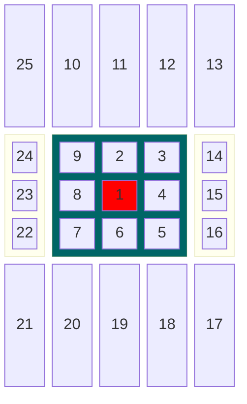

# Specification
Creating Gomuku game with AI. The core of this project is AI algorithm with special attention to optimization of the algorithm. Some heuristic logic is created to assess the probability of next best move for optimization purpose. Iterative depth is used in minimax to keep the calculation time for next move tolerable. 

Gomuku will be played in 20 x 20 grid and 5 pieces in row wins. There are 2 players. Players are taking turns inserting one piece at a time trying to get 5 of their own pieces in a row horizontally, vertically or diagonally. Game continues until either one of the players gets 5 pieces in a row or the spaces run out in 20 x 20 grid. This equals 400 pieces total.

## Programming language
- Python (version 3.12)

## Possibility to review
- Python, JavaScript

## Algrorithms to use
- minimax enhanced with alpha-beta pruning

## Problem to solve
- The minimax algrithm with alpha-beta pruning needs to be created. The first problem is to figure out how the goodness of the move is measured. The second problem that needs to be solved is the heuristics for function to estimate how good the move is. This estimate is used for ordering the moves for alpha-beta pruning to increase the pruning efficiency.

## Program inputs (and how to use them)
- Program will get inputs from users mouse pointer that is then converted into game board coordinates for the new pieces to be added. These coordinates will be then validated. If the piece is successfully inserted to the board the AI will determine it's best possible move that it can calculate within a specified time limit. After the AI has played its piece, the user gets to select another place for their piece.

## Performance targets for time and space
- The target performance for time is O($b^d)$ at first and then trying to optimize with alpha beta pruning to get closer to O($\sqrt{b^d}$). This improvement depends on how well the heuristics are applied to the ordering of the alpha-beta pruning branch order.
- Some memoization is used to reduce recalculation of the moves that are already calculated during earlier moves. This will require some space but because of algorithm time limit for each move the depth of branches in the calculation is kept quite low (2 moves from the previously played coordinates) which means that after a piece is placed, there will be maximum of 25-1=24 moves that need to be calculated for goodness of the move.

- So these values will be saved for each move and updated when necessary. Because there is maximum amount of 20 x 20 = 400 places for pieces and we know that the calculation is only for the surrounding cells and the calculation result for each cell is max 24 because of calculating only 2 closest cells to the previous move, the space requirement is O(c*n) => O(n), where c is constant.

## Sources:
- [Gomoku](https://en.wikipedia.org/wiki/Gomoku)
- [Minimax](https://en.wikipedia.org/wiki/Minimax)
- [Alpha-beta pruning](https://en.wikipedia.org/wiki/Alpha%E2%80%93beta_pruning)

## Other
- Study programme: TKT
- Language used for documentation: English
